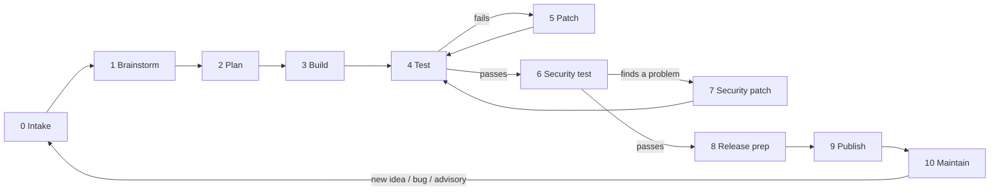

# NovaDM production pipeline

Every idea, feature or fix goes through these stages, in order. Each stage ends with a **gate**:
the next stage starts only when the gate is met. Stages 4, 6 and 9 also run automatically on
GitHub (`.github/workflows/`).

## 0. Intake: how big is it?

Every request is sized first. The size picks the version number ([Semantic Versioning](https://semver.org/))
and how much of the pipeline it needs.

| Size | Examples | Version | Stages |
|---|---|---|---|
| **Hotfix** | a crash, a broken site, a security advisory | patch: 1.3.**1** | 0 → 3 → 4 → 6 → 8 → 9 (no brainstorm or plan doc) |
| **Minor** | a setting, a shortcut, a small panel, one menu item | minor: 1.**4**.0 | all stages; the plan is a short list in the chat |
| **Major** | a new area (tabs, sync, Tor windows), a change to stored data | minor or major | all stages; the plan is a file `docs/vX.Y-plan.md` |

**Minor requests are bundled.** One small feature alone is not worth a release (every release is a
download for users). When a request is minor, Claude answers with **2–4 features from the backlog
that fit with it**, so the update is worth installing, and the user picks which to add. The backlog
is the table in [feature-requests-research.md §3](feature-requests-research.md), plus anything the
user has asked for and not yet received. Good companions share the same area (downloads, tabs,
privacy) or the same code, so they cost little extra.

**Gate:** size agreed, and the bundle picked for minor requests.

## 1. Brainstorm

- What problem does it solve, and for whom? How do Brave, Chrome, Firefox, IDM or 1DM do it?
- 2–3 ways to build it, with their cost: app size, memory, speed, privacy, upkeep.
- Can it be done in Electron at all? (Some Chromium features are missing: password manager,
  Safe Browsing, app-bound encryption.)

**Gate:** one approach chosen, with the reason.

## 2. Plan

- The files it touches, the settings it adds (with defaults), the UI text.
- **Acceptance tests:** what a test will check to prove it works, written before the code.
- **Security questions** (answered now, checked in stage 6):
  - Does anything new leave the PC? What exactly, to whom? Can it be turned off?
  - Is anything new stored? Where, and is it encrypted if it's personal?
  - Can a web page reach the new code (IPC, preload, URL scheme)? How is the sender checked?
  - Does it download or run anything?
- Major requests: write `docs/vX.Y-plan.md`.

**Gate:** the user approves the plan.

## 3. Build

- Work on a branch (`feat/<name>` or `fix/<name>`) and open a pull request, so CI tests it before
  it reaches `main`.
- Smallest change that does the whole job; follow the code around it; no new dependency for a
  few lines.
- Add the unit test or self-test from the plan along with the code.

**Gate:** the feature works by hand in `npm start`.

## 4. Test

| What | Command | Where |
|---|---|---|
| Unit tests (fast, offline) | `npm test` | local + CI |
| The feature's own self-test | `NOVADM_SELFTEST=tools/selftest-<name>.js` (see README) | local |
| Regression self-tests the change could affect (popup, phase2–6, v1, v12, speed, transport, security, downloads) | same | local |
| Speed / memory, if the change touches page loading | `tools/selftest-speed.js`, Task manager (Shift+Esc) | local |

**Gate:** everything passes, and results match what's expected (not just "no error").

## 5. Patch

Fix the cause, not the symptom, then go back to stage 4. If a fix breaks something else, roll it back
(`git restore` / `git revert`) and try another way. Every bug found gets a test so it can't come back.

## 6. Security test

| What | Command | Where |
|---|---|---|
| Known vulnerabilities in dependencies | `npm audit --omit=dev --audit-level=high` | local + CI |
| Static analysis of the code | CodeQL (`security-extended`) | CI, weekly + every push |
| Built app: fuses, code-injection attempts, tampered app, encrypted cookies | `npm run dist` then `node tools/check-build-security.js` | local + CI on tags |
| The stage-2 security questions | review the diff against them | local |
| Sign-in protections still work | `tools/selftest-security.js` | local |

**Gate:** no high or critical finding left open. See [security.md](security.md) for what each
protection covers.

## 7. Security patch

Fix the finding (update or override the dependency, validate the input, check the sender), add a
test that would have caught it, and go back to stage 4. If no fix exists, write the risk and the
workaround in the CHANGELOG and `docs/security.md`.

## 8. Release prep

1. Version in `package.json` and `package-lock.json`.
2. `CHANGELOG.md`: move "Unreleased" under the new version (Added / Changed / Fixed / Security).
3. `README.md` features, and `docs/security.md` if a protection changed.
4. Privacy gate: `node tools/check-private.js` (and `--build` after `npm run dist`). Personal
   strings to look for go in `.private-patterns` (never committed).

**Gate:** all three checks clean.

## 9. Publish

1. Merge the pull request into `main` once CI is green.
2. Annotated tag: `git tag -a vX.Y.Z -m "
"`, then `git push origin main vX.Y.Z`.
3. CI builds the installer and the portable version, runs the build security checks and the
   privacy check, and creates a **draft** release with the CHANGELOG notes and SHA-256 sums.
4. Check the draft (notes, both files attached), then publish it on GitHub.

**Gate:** the release is public and its download runs on a clean Windows user profile.

## 10. Maintain

- **Dependabot** opens pull requests for dependency updates weekly (Electron security fixes come
  this way). Each one goes through CI; Electron major updates go through stage 4 in full.
- **CodeQL** re-checks the code weekly with new rules.
- GitHub issues, and every new idea, go back to stage 0.
- Rolling back: every version has a tag and a release, so `git checkout vX.Y.Z` or the older
  installer gives you the previous version.
